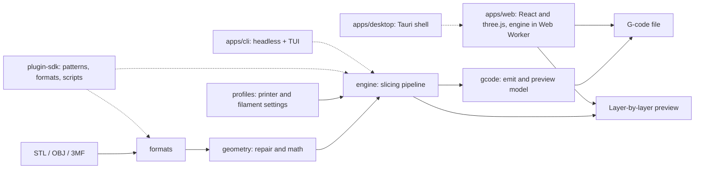

# NozzleBench

The modern, browser-native slicer for 3D printing — rebuilt from scratch, without the legacy bloat.

## Status

> **Design stage.** No releases are cut yet. This README is the design contract for the repository: the layout, feature set, and stack below are the targets the project is building toward. Paths listed may not exist until their roadmap phase.

## What is NozzleBench?

NozzleBench is a clean-room, browser-native 3D printing slicer in the class of OrcaSlicer and PrusaSlicer — rebuilt for the web first.

- **Runs fully in the browser** — the entire slicing pipeline executes client-side in Web Workers. Models and G-code never leave your machine; no account, no cloud.
- **Downloadable when you want it** — the same UI ships as small native desktop builds for Windows, macOS, and Linux via Tauri.
- **Headless when you need it** — a CLI drives the same engine for scripting and CI, with an interactive TUI (`cli tui`) for working from the terminal.
- **A fresh codebase, not a fork** — no C++/wxWidgets heritage, no legacy compatibility paths. OrcaSlicer-class capabilities re-designed around a modular TypeScript core.

## Design principles

1. **Browser-first, local-first.** Full slicing in Web Workers; privacy by default.
2. **No legacy bloat.** Clean-room TypeScript; every feature earns its place.
3. **Lean core, plugins for the rest.** A small opinionated core; calibration tools, profile packs, and extra formats and patterns are opt-in packages.
4. **One language, one toolchain.** TypeScript everywhere, driven by Bun (runtime, package manager, test runner). WebAssembly remains an optimization path if profiling ever demands it — not a prerequisite.
5. **Profiles are data.** Printers, filaments, and process settings are validated, versioned data — shareable like code.

## Repository layout

Bun workspaces monorepo. All packages are scoped `@NozzleBench/*`.

| Path | Package | Purpose |
|---|---|---|
| `packages/formats` | `@NozzleBench/formats` | Mesh import/export: STL (ASCII + binary), OBJ, 3MF |
| `packages/geometry` | `@NozzleBench/geometry` | Mesh data model, repair (manifold checks, hole filling), intersection math |
| `packages/engine` | `@NozzleBench/engine` | Slicing pipeline: perimeters, infill, supports, bridging, path planning. Runtime-agnostic: browser worker, Bun, or Node |
| `packages/gcode` | `@NozzleBench/gcode` | G-code generation, parsing, and toolpath preview model |
| `packages/profiles` | `@NozzleBench/profiles` | Schemas + validation for printer, filament, and process profiles; curated defaults; importer for existing OrcaSlicer/PrusaSlicer config bundles |
| `packages/plugin-sdk` | `@NozzleBench/plugin-sdk` | Plugin API and loader: infill patterns, mesh formats, post-processing |
| `apps/web` | — | Browser app: React + three.js UI, engine in Web Workers; deployed to GitHub Pages |
| `apps/desktop` | — | Tauri shell packaging the same UI for Windows, macOS, and Linux |
| `apps/cli` | — | Headless slicing on Bun and Node; interactive TUI (`cli tui`) |

## Architecture



## Feature targets

### Core — ships with the app

- **Walls & surfaces:** classic and variable-width perimeters, seam position and gap control, ironing, fuzzy skin.
- **Infill:** pattern library (grid, gyroid, lightning, …), density and angle control, wall/infill ordering.
- **Supports & overhangs:** tree and classic supports, support painting, bridging, support ironing.
- **First layer & adhesion:** initial-layer speed, height, and flow; skirt, brim, and mouse-ear brims; adaptive bed-mesh regions.
- **Special modes:** vase mode, polyhole compensation.
- **Multi-plate & multi-material:** queue plates with per-part settings; multi-extruder workflows.
- **Inspection:** live G-code preview, real-time print-time and material estimates, seam painting.

### Plugins — opt-in packages

- **Calibration suite:** temperature towers, flow and max-volumetric-speed tests, pressure advance, retraction, tolerance, input-shaping tests.
- **Profile packs:** community printer and filament bundles (Bambu Lab, Prusa, Creality, Voron, VzBot, RatRig, Flashforge, …).
- **Extensions:** custom infill patterns, new mesh formats, post-processing scripts.

## Tech stack

- **Language & runtime:** TypeScript (strict), Bun for package management, test running, and local tooling.
- **Web UI:** React 19 + three.js via react-three-fiber; WebGPU rendering with WebGL2 fallback.
- **Concurrency:** slicing in Web Workers (browser) and Workers (Bun and Node); the UI never blocks.
- **Desktop:** Tauri 2.
- **Monorepo:** Bun workspaces.

## Development

> Target setup once the scaffold lands (roadmap phase M0).

```bash
bun install    # install all workspaces
bun run dev    # start apps/web on localhost
bun test       # full workspace test suite
bun run build  # typecheck and build all packages
```

### Running the AI bots locally

The bots live entirely in `.github` (workflows + the `run-omp` composite action). The same task can be run by hand:

```bash
OMP_TASK="Review PR 12: post a comment with a verdict and set ai-passed-review or ai-failed-review (removing ai-needs-review)." \
GH_TOKEN="$(gh auth token)" \
omp -p "$OMP_TASK" --auto-approve
```

## Git & GitHub workflow

An AI-assisted release train. `main` holds released code only; `release` is the integration branch. The AI is the [omp](https://omp.sh) coding agent, running non-interactively inside GitHub Actions (`omp -p "task"`); it comments on every action it takes, and labels carry the state between runs.

- **Branches.** Features branch from `release` as `feature/*`. `main` receives changes only through release-train PRs (or `hotfix/*` PRs in emergencies).
- **Every PR** runs the app build (`bun test` + `bun run build`). On open and on every push, the bot clears every `ai-*` label and adds `ai-needs-review`.
- **AI review.** Adding `ai-needs-review` starts the omp reviewer. It reviews the diff, comments on the PR, removes `ai-needs-review`, and adds `ai-passed-review` or `ai-failed-review`.
- **AI fix loop.** Adding `ai-failed-review` starts the omp fixer. It edits the branch and pushes, which restarts the build and review. Capped at 3 fix attempts, then `ai-needs-human`.
- **Release train (daily, 06:00 UTC).** A bot merges every open PR whose build is green and carries `ai-passed-review` into `release`, pushes, and opens a PR from `release` to `main`. When that PR's build passes, it is auto-merged to `main`.
- **Main.** Every successful `main` push creates a `v<version>` GitHub Release with a changelog of merged PRs, and deploys the web app to GitHub Pages. If the main build fails, the bot tracks it as an issue labelled `main-broken`: the first failure opens it, consecutive failures append to it, and the next green build closes it.
- **Issues track committed work.** GitHub Issues is reserved for features and bugs the project is committed to fixing — the triaged backlog, not a suggestion box. Every PR references the issue it resolves.
- **Discussions are the front door.** Users report possible issues, bugs, and feature ideas in GitHub Discussions. Maintainers sort things out there; when a discussion needs an issue, an admin creates it. The daily backlog scan only reviews the codebase, never discussions.

### Automation

Deterministic state (labels, checks, the `main-broken` issue lifecycle, auto-merge) lives in the workflows; omp does the scanning, implementing, reviewing, fixing, and release-train merging. The driver is the `.github/actions/run-omp` composite action: it installs omp on the runner, writes the optional provider config, and runs one task non-interactively via `omp -p "task"`.

#### What happens — the full loop

| When | Workflow | What happens | Result |
|---|---|---|---|
| once, after enabling Actions | `init.yml` | doctor: creates any missing labels, verifies secrets (fails if no AI provider key) | repo is ready |
| once, at project start | `seed.yml` | omp reads the README and files the roadmap (M0–M5) + feature-target issues, labelled `backlog`; tags `main` as `gen-1` | initial backlog (generation 1) |
| daily 05:30 UTC | `backlog.yml` | omp scans the codebase for bugs, improvements, and tech debt; files issues (deduped, max 10) | backlog stays populated |
| daily 06:00 UTC | `train.yml` | omp merges every PR with a green build and `ai-passed-review` into `release`, pushes, and opens/updates the `release → main` PR | release advances |
| after the train PR | `auto-merge.yml` | when the `release → main` PR's build is green, auto-merge is enabled | main advances |
| daily 07:00 UTC | `implement.yml` | picks the next open `backlog` issues (oldest first, no open PR, default 2), implements each on `feature/*` off `release`, opens a PR (`Closes #N`) against `release` | new PRs enter the loop |
| backlog empty (07:00 UTC check) | `implement.yml` regenerate | tags `main` as `gen-<N>` (next generation) and re-seeds: re-reads the README + codebase and files the next batch of `backlog` issues | new generation starts |
| every PR open/update | `ci.yml` | test matrix (3 OS) + typecheck/build run on the PR | build status |
| every PR open/update | `pr.yml` | clears all `ai-*` labels, adds `ai-needs-review` | state is set |
| `ai-needs-review` added | `ai.yml` review | omp reviews the diff, comments, sets `ai-passed-review` or `ai-failed-review`, removes `ai-needs-review` | verdict |
| `ai-failed-review` added | `ai.yml` fix | omp fixes the findings and pushes; the build + review loop restarts (max 3 fixes, then `ai-needs-human`) | PR converges |
| push to `main` | `main.yml` | build; on red: `main-broken` issue opened (first) or appended (consecutive); on green: issue closed | main health tracked |
| green `main` build | `main.yml` release | creates the `v<version>` GitHub Release with a changelog of merged PRs | release shipped |
| green `main` build | `main.yml` pages | builds `apps/web` (stub until the real app lands) and deploys to GitHub Pages | web app live |

Humans stay in the loop for: GitHub Discussions (sorting things out, creating issues from them), `ai-needs-human` escalations, and any issue the implementer declines.

Labels: `ai-needs-review`, `ai-passed-review`, `ai-failed-review`, `ai-needs-human`, `ai-review-error`, `main-broken`, `backlog`. Run the `init` workflow once after enabling Actions — it creates any missing labels and reports missing secrets. The workflows assume the labels exist.

To bootstrap the project: run the `seed` workflow — omp reads this README and creates the roadmap + feature-target backlog as issues labelled `backlog` (existing issues are never duplicated), tagging `main` as `gen-1`. From there the loop runs itself: the daily implementer picks up open `backlog` issues without an open PR, implements each on a `feature/*` branch, and opens a PR (`Closes #N`) against `release`. The build, AI review, release train, GitHub Release, and Pages deploy pipeline then takes over. When the backlog is empty, the implementer tags `main` as the next generation (`gen-2`, `gen-3`, …) and re-seeds: it re-reads the README and codebase and files the next batch of issues — the loop never stalls. The `gen-<N>` tags mark the start commit of every work batch.

Secrets — at least one model provider key:

| Secret | Purpose |
|---|---|
| `ANTHROPIC_API_KEY` / `OPENAI_API_KEY` / `DEEPSEEK_API_KEY` / `OPENCODE_API_KEY` / `GEMINI_API_KEY` / `OPENROUTER_API_KEY` / `XAI_API_KEY` / `LITELLM_API_KEY` | omp provider credentials (any supported one) |
| `OMP_MODEL` | optional, e.g. `anthropic/claude-sonnet-4-5` |
| `OMP_MODELS_YAML` | optional custom `models.yml` content for non-built-in endpoints |

Releases go to GitHub Releases (changelog from merged PRs) and the web app deploys to GitHub Pages — no publish secret needed. Enable Pages with **GitHub Actions** as the build source in repo settings.

Repo settings: protect `main` and `release` with required status checks, and enable auto-merge.

## Roadmap

| Phase | Deliverable | Packages |
|---|---|---|
| M0 | Scaffold: Bun workspaces, package skeletons, CI + AI review pipeline | all |
| M1 | Mesh I/O + repair: STL, OBJ, 3MF in; watertight meshes out | formats, geometry |
| M2 | First slice: import → print-ready G-code, headless CLI + TUI | engine, gcode, cli |
| M3 | Browser app: 3D viewer, worker slicing, layer preview | web |
| M4 | Profiles + plugin system; calibration suite as first plugin | profiles, plugin-sdk |
| M5 | Desktop builds + profile-pack registry | desktop |

## Contributing

- Report suspected bugs and feature ideas in Discussions; confirmed work is tracked as Issues.
- Propose new plugins or profile packs in discussions before writing code.
- PRs against an open issue, with tests for new behavior.
